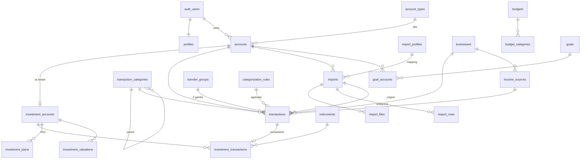

# 01 — Database Schema Plan

Fonte di verità: `supabase/migrations/*.sql`. Questo documento spiega le
scelte; in caso di discrepanza vince la migration.

| Migration | Contenuto |
|---|---|
| `…0001_schema.sql` | Enum, domini, tabelle, vincoli, indici, trigger di integrità, vista saldi |
| `…0002_security.sql` | RLS su ogni tabella, revoke per `anon`, audit log |
| `…0003_storage.sql` | Bucket privato `imports` + policy per cartella utente |
| `…0004_bootstrap.sql` | Profilo e configurazione iniziale alla creazione utente |
| `…0005_enforce_aal2.sql` | Policy restrictive: accesso ai dati solo con sessione MFA (AAL2) |

## Convenzioni

- **Denaro**: `bigint` in centesimi, colonne `*_cents`. Importi firmati dal punto
  di vista del conto (uscita < 0). In TypeScript il valore arriva come `number`
  (sicuro fino a ±90 mila miliardi di euro) ed è tipizzato `Cents`.
- **Quantità e prezzi titoli**: `numeric(28,10)` / `numeric(20,8)`.
- **Date contabili**: `date` (giorno di calendario, nessun fuso). Timestamp di
  sistema: `timestamptz`.
- **Proprietà**: ogni tabella utente ha `user_id uuid not null default auth.uid()`.
- **FK composte** `(x_id, user_id) → parent(id, user_id)`: il database rifiuta
  riferimenti a righe di un altro utente, anche se l'id fosse noto. `on delete
  set null (x_id)` (PostgreSQL 15+) annulla solo la colonna di riferimento.
- **Enum PostgreSQL** per i concetti stabili (`transaction_type`, `nature`…);
  `text + check` per le liste destinate a cambiare.
- **Nessun saldo memorizzato**: `account_balances` (vista `security_invoker`)
  lo calcola, quindi non può andare fuori sincrono.

## Diagramma delle relazioni

## Tabelle

### Identità e riferimenti
- **profiles** — 1:1 con `auth.users`: valuta base (EUR), locale `it-IT`, fuso
  `Europe/Rome`, inizio settimana (lunedì), tema, opt-in AI. Creato dal trigger
  di signup; il client può solo leggerlo e aggiornarlo.
- **account_types** — riferimento globale in sola lettura: `checking, savings,
  card, wallet, cash` (liquidi), `broker` (investimento), `other`.

### Conti e dimensioni di analisi
- **accounts** — nome, istituto, tipo, valuta, saldo iniziale + data, banca
  CSV predefinita, colore/icona, attivo. Iniziali: ING Direct, Revolut, Trade Republic.
- **businesses** — VOXEL Studio, Il Progettista Meccanico, Altro (+ futuri).
- **income_sources** — Stipendio, VOXEL Studio, YouTube, Altri guadagni;
  collegabili a un business.
- **transaction_categories** — albero a 2 livelli con `kind`
  (`income/expense/transfer/investment`); trigger impone profondità e kind
  coerente. Categorie della specifica §7 precaricate e modificabili.

### Movimenti
- **transactions** — vedi specifica §10. Punti chiave:
  - `original_description`, `fingerprint`, `account_id`, `source` immutabili (trigger);
  - check di coerenza: income/refund > 0, expense < 0, `transfer ⇔ nature transfer`,
    `investment ⇒ nature investment`, fonte di reddito solo su income, importo ≠ 0;
  - `is_transfer` colonna generata (`type in (transfer, investment)`);
  - `unique (account_id, fingerprint)` = barriera anti-duplicati;
  - indici per data, conto, categoria, business, gruppi trasferimento, import,
    "da categorizzare" e indice trigram per la ricerca testuale.
- **transfer_groups** — lega le gambe di un movimento interno (`internal`) o
  verso investimenti (`investment`); `detected_by` auto/manual + confidenza.

### Import
- **import_profiles** — mapping per banca (encoding, delimitatore, formato data,
  separatore decimale, importo firmato o dare/avere, mappa colonne JSON). Uno di
  default per banca.
- **imports** — una sessione di import: stato (`pending → preview → committed`,
  oppure `failed/cancelled/rolled_back`), contatori (totali, nuove, duplicate,
  possibili duplicate, invalide, importate), totali entrate/uscite/trasferimenti,
  periodo coperto.
- **import_files** — file in Storage, nome originale, dimensione, sha256 (avviso
  "file già caricato"), encoding/delimitatore rilevati, intestazioni.
- **import_rows** — staging dell'anteprima: riga grezza (`raw`), valori
  normalizzati, proposta di classificazione, stato, errori, duplicato/trasferimento
  candidato, transazione creata. Dà il "Visualizza dettagli" dello storico.

### Categorizzazione
- **categorization_rules** — campo (descrizione/controparte), tipo match
  (contains/equals/starts_with/regex), filtri opzionali (conto, direzione, range
  importo), azioni (`set_type/nature/category/business/income_source`, almeno una),
  priorità, origine (`system/user/learned`), confidenza, contatore utilizzi.

### Investimenti
- **investment_accounts** — estensione 1:1 di un conto `broker` (trigger lo verifica).
- **instruments** — ETF/azioni/… con ISIN validato.
- **investment_plans** — PAC: importo, frequenza, giorno, strumento, date.
- **investment_transactions** — buy/sell/dividend/interest/fee/tax/deposit/withdrawal
  con quantità, prezzo, commissioni, tasse; `cash_transaction_id` collega il
  versamento in `transactions`. Versamento e rendimento restano separati.
- **investment_valuations** — valore di mercato per conto (o per strumento) a
  una data; serve perché il valore non è derivabile dai movimenti.

### Pianificazione
- **budgets / budget_categories** — budget mensile/annuale per categoria.
- **goals / goal_accounts** — obiettivo manuale o legato a una quota (bps) del
  saldo di uno o più conti.

### Cache e storico
- **monthly_snapshots / yearly_snapshots** — aggregati ricalcolati dal server
  (con le stesse funzioni di `lib/analytics`) dopo import e modifiche.
- **net_worth_snapshots** — patrimonio a una data con dettaglio per conto
  (`total = liquid + invested`, vincolo DB). Indispensabile per lo storico del
  valore investimenti.

### Audit
- **audit_logs** — append-only: tabella, record, azione, campi modificati,
  valori prima/dopo. Scritto da un trigger `security definer` su conti,
  transazioni, regole, import, investimenti, budget, obiettivi. Gli insert
  registrano solo il riferimento; gli update senza modifiche reali sono ignorati.

## Ciclo di vita e cancellazioni

- Un conto con movimenti non si cancella (FK `no action`): si archivia (`is_active = false`).
- Annullare un import (`rolled_back`) cancella le sue transazioni con una
  server action dedicata, registrata nell'audit.
- Cancellare l'utente rimuove tutto in cascata (verificato dai test).

## Generazione tipi

`types/database.ts` è generato da `npm run db:types` (`supabase gen types
typescript --local` sullo stack locale, poi formattato con Prettier: l'output
è deterministico). Non si modifica a mano. Alias comodi in `types/domain.ts`.
Due controlli impediscono che i tipi divergano dallo schema:
`tests/unit/generated-types.test.ts` (tabelle, viste, enum confrontati con le
migration) e il job CI `supabase-local`, che rigenera i tipi e fallisce se
`git diff` non è vuoto.

## Uso delle tabelle di import (Sprint 3; colonne aggiunte in 0006)

- `imports.bank_profile` = fonte (`ing`, `revolut`, `trade_republic`); stato
  `preview` → `committed` (o `cancelled`).
- `import_files.header` conserva l'intestazione: alla conferma il mapping viene
  ricalcolato in modo deterministico e ogni riga è rinormalizzata da `raw`.
- `import_rows`: una riga per riga CSV. `status` = `new` (da importare),
  `duplicate`, `possible_duplicate`, `invalid`, `skipped` (esclusa dall'importer
  con motivo in `errors`, o dall'utente), `imported`. "Da verificare" è
  derivato: nessun `proposed_type`, o confidenza < 0,6 non confermata a mano.
- `transactions.fingerprint` / `investment_transactions.fingerprint`: chiave di
  deduplicazione (identificativo della fonte o hash con indice di occorrenza).
- `instruments` creati per ISIN alla conferma (`unique (user_id, isin)`).

## Migration 0006 — hardening import (Sprint 3 Hardening)

Estensione minima, nessuna nuova tabella (RLS e policy AAL2 esistenti coprono
le nuove colonne):
- `accounts.iban` (facoltativo, formato IBAN, unico per utente): riconosce i
  trasferimenti tra conti propri dall'IBAN della controparte.
- `categorization_rules`: `match_field` anche `counterparty_iban` e
  `source_type` (causale/tipo della banca); `sources` (fonti a cui si applica);
  `set_transfer_account_id` (conto di destinazione, FK composita sullo stesso
  utente, solo per regole transfer/investment); `review_reason` (regola che
  chiede revisione esplicita); `version` incrementata dal trigger
  `bump_rule_version` a ogni modifica della definizione (non dei contatori d'uso;
  lo storico completo è in `audit_logs`).
- `import_rows.transfer_account_id`: conto proprio proposto/scelto in anteprima.
- `seed_import_defaults(user_id)`: conti "ING Conto Risparmio" (savings) e
  "Carta di credito" (card), senza banca CSV predefinita, e le regole iniziali
  come dati. Chiamata dal trigger di registrazione e una volta per gli utenti
  esistenti; idempotente (per nome).

## Migration 0007 — aggregati della dashboard (Sprint 4)

Solo funzioni di lettura, nessuna tabella e nessuna metrica salvata:
`dashboard_monthly_flows`, `dashboard_category_spending`,
`dashboard_income_by_source`, `dashboard_business_performance`,
`dashboard_account_changes`, `dashboard_invested_at_cost`, `net_worth_history`.
Tutte `SECURITY INVOKER` (RLS + AAL2 invariati), `STABLE`, `search_path = ''`,
eseguibili solo da `authenticated`. Stessa finestra del saldo iniziale di
`account_balances`. Formule in `docs/07-dashboard.md`.

## Lettura dei movimenti

PostgREST restituisce al massimo 1000 righe per richiesta (`max_rows`) e tronca
in silenzio. Le letture che devono essere complete (flussi e grafico di un
conto) paginano con `range()` fino all'ultima pagina
(`server/repositories/accounts.ts`, verificato con 1.205 righe in
`tests/integration/accounts.test.ts`). Per gli aggregati su molti conti e anni
(dashboard, Sprint 6) andrà valutata una vista o funzione SQL dedicata.
